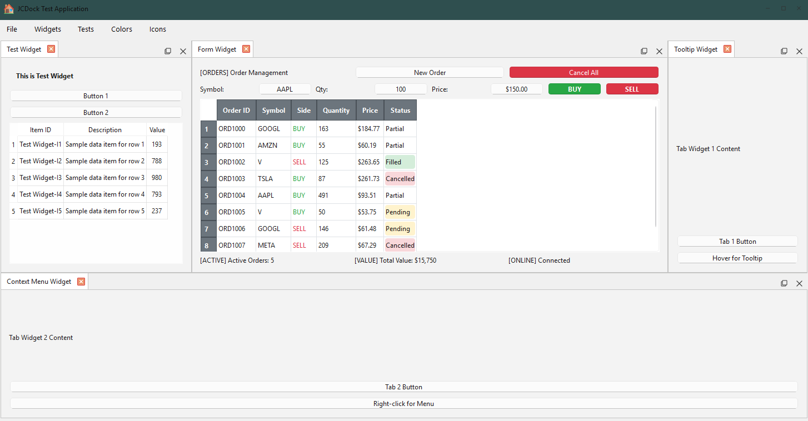

# JCDock

A flexible and customizable docking framework for PySide6 applications, inspired by modern IDEs.

JCDock allows you to create complex user interfaces where widgets can be docked into containers, undocked into floating windows, and rearranged dynamically by the user through an intuitive drag-and-drop interface.

## Features

* **Advanced Docking**: Dock widgets to the top, bottom, left, right, or center of other widgets and containers with visual overlay guides.
* **Floating Windows**: Undock any widget or group of widgets into its own floating window with native-like appearance including drop shadows and proper window management.
* **Tearable Tabs**: Users can tear individual tabs away from a tab group to instantly create new floating windows with smooth visual feedback.
* **Persistent Layouts**: Save and restore complete application layouts with automatic widget recreation through the registry system.
* **Nested Splitters**: Automatically create and manage complex nested horizontal and vertical splitter layouts.
* **Multi-Monitor Support**: Full support for dragging and docking across multiple monitors with proper coordinate handling.
* **Performance Optimized**: Built-in caching systems for icons and hit-testing to ensure smooth performance even with complex layouts.
* **Customizable Appearance**: Easily customize title bar colors, widget styling, and visual effects.
* **Signal System**: Comprehensive event system to track widget docking, undocking, and layout changes.

***
## Installation

JCDock is available on PyPI and can be installed using pip. Choose the installation method that best fits your needs:

### Option 1: Install from PyPI (Recommended for Users)

For most users who want to use JCDock in their applications:

```bash
pip install JCDock
```

This installs the latest stable release directly from PyPI.

### Option 2: Install from Source (For Development)

For developers who want to contribute to JCDock or need the latest development features:

```bash
# 1. Clone the repository from GitHub
git clone https://github.com/JustiSoft/JCDock.git

# 2. Navigate into the cloned directory
cd JCDock

# 3. Install in "editable" mode
pip install -e .
```

Using the `-e` or `--editable` flag is recommended for development. It installs the package by creating a link to the source code, so any changes you make to the code will be immediately reflected in your environment.

***
## Architecture Overview

JCDock uses a unified window model where all floating windows are `DockContainer` instances. The architecture is built around a central state machine with specialized components:

### Core Components
- **DockingManager**: Central orchestrator managing all docking operations, widget registration, and layout persistence
- **DockingState**: State machine defining operational states (IDLE, RENDERING, DRAGGING_WINDOW, RESIZING_WINDOW, DRAGGING_TAB)
- **DockPanel**: Wrapper for any QWidget to make it dockable with title bars and controls  
- **DockContainer**: Unified container system supporting both embedded and floating windows with configurable behavior (main window, persistent root, title bars, etc.)
- **TearableTabWidget**: Enhanced tab widget supporting drag-out operations with visual feedback

### Specialized Systems

#### Core (`core/`)
- **WidgetRegistry**: Registry system for widget types enabling automatic layout persistence
- **DockingState**: State machine enum defining operational states

#### Model (`model/`)
- **LayoutSerializer**: Handles serialization and deserialization of dock layout state
- **LayoutRenderer**: Handles layout rendering and state transitions
- **LayoutModel**: Core data structures for layout representation

#### Interaction (`interaction/`)
- **DragDropController**: Manages drag-and-drop operations and visual feedback
- **OverlayManager**: Manages visual overlay system during drag operations
- **DockingOverlay**: Visual feedback overlays for drop zones

#### Factories (`factories/`)
- **WidgetFactory**: Creates and manages widget instances
- **WindowManager**: Handles window creation and management
- **ModelUpdateEngine**: Manages model state updates

#### Utils (`utils/`)
- **HitTestCache**: Performance optimization for overlay hit-testing during drag operations
- **IconCache**: LRU cache system for icon rendering performance optimization

## Basic Usage

Here's the simplest possible example showing how to create a floating dockable widget:

```python
import sys
from PySide6.QtWidgets import QApplication, QLabel
from PySide6.QtCore import Qt

from JCDock import DockingManager

if __name__ == "__main__":
    app = QApplication(sys.argv)

    # 1. Create the Docking Manager
    manager = DockingManager()
    
    # 2. Create content and make it a floating dockable widget
    content = QLabel("Hello, JCDock!")
    content.setAlignment(Qt.AlignCenter)
    manager.create_simple_floating_widget(content, "My Widget")

    sys.exit(app.exec())
```

### Creating a Main Window with Docking

For a more complete application with a main window and multiple dockable widgets:

```python
import sys
from PySide6.QtWidgets import QApplication, QLabel, QTextEdit
from PySide6.QtCore import Qt

from JCDock import DockingManager, DockContainer

if __name__ == "__main__":
    app = QApplication(sys.argv)

    # 1. Create the Docking Manager
    manager = DockingManager()
    
    # 2. Create a main window using DockContainer
    main_window = DockContainer(
        manager=manager,
        show_title_bar=True,
        is_main_window=True,
        window_title="My Application",
        auto_persistent_root=True
    )

    # 3. Create simple floating widgets
    project_content = QLabel("Project Explorer")
    _, project_panel = manager.create_simple_floating_widget(project_content, "Project")

    editor_content = QTextEdit("Your code here...")
    _, editor_panel = manager.create_simple_floating_widget(editor_content, "Editor")

    # 4. Dock widgets to create layout
    manager.dock_widget(project_panel, main_window, "left")
    manager.dock_widget(editor_panel, project_panel, "right")

    main_window.setGeometry(100, 100, 1000, 600)
    main_window.show()

    sys.exit(app.exec())
```

## Complete Examples and Testing

### Comprehensive Test Suite

JCDock includes a modular test suite that demonstrates all framework capabilities and serves as both a testing framework and reference implementation. To run the test suite:

```bash
# From the Examples directory
cd src/JCDock/Examples
python run_test_suite.py
```


*Example of JCDock in action showing floating windows, docked panels, and tearable tabs*

The test suite (`src/JCDock/Examples/test_suite/`) features a modular architecture with:

#### Core Components
- **`main.py`** - Application entry point and configuration
- **`app.py`** - Main application class with UI coordination

#### Managers (`managers/`)
- **`test_manager.py`** - Test execution and validation
- **`ui_manager.py`** - Menu system and user interface management  
- **`layout_manager.py`** - Layout persistence and file operations

#### Test Widgets (`widgets/`)
- **`test_widgets.py`** - Registry-based widgets with `@dockable` decorators
- **`financial_widgets.py`** - Complex financial dashboard widgets (Chart, Order, Portfolio)

#### Utilities (`utils/`)
- **`constants.py`** - Application constants and configuration
- **`data_generator.py`** - Random data generation for testing
- **`test_utilities.py`** - Testing helper functions and validation

#### Key Testing Features
- **Registry-based widget creation** using `@dockable` decorators
- **Both API paths**: "By Type" (registry-based) and "By Instance" (existing widgets)
- **Comprehensive testing functions** for all API methods including widget finding, listing, docking operations, and state management
- **Signal system usage** with event listeners for layout changes
- **Interactive menu system** for testing different features and operations
- **Layout persistence testing** with automatic save/load validation
- **Performance monitoring** and drag operation testing

### Layout Persistence

The test suite demonstrates automatic layout persistence using the standard layout file location:

```
layouts/
└── jcdock_layout.ini  # Automatically saved/loaded layout file
```

The layout file preserves:
- **Widget positions** and container hierarchies
- **Window geometry** and multi-monitor positioning
- **Widget state** (custom data via `get_dock_state()`/`set_dock_state()`)
- **Tab ordering** and splitter proportions

## Advanced Features

### Layout Persistence

JCDock automatically supports saving and restoring layouts when you use the registry system with `@dockable` decorated widgets:

```python
from PySide6.QtWidgets import QLabel, QTextEdit
from JCDock import dockable

# Register widget types for automatic layout persistence
@dockable("project_explorer", "Project Explorer")
class ProjectWidget(QLabel):
    def __init__(self):
        super().__init__()
        self.setText("Project Files")

@dockable("code_editor", "Code Editor")
class EditorWidget(QTextEdit):
    def __init__(self):
        super().__init__()
        self.setPlainText("# Your code here")

# Create widgets using registry keys
manager.create_floating_widget_from_key("project_explorer")
manager.create_floating_widget_from_key("code_editor")

# Save and restore layouts (binary format)
layout_data = manager.save_layout_to_bytearray()

# Later, restore the exact same layout
manager.load_layout_from_bytearray(layout_data)
```

The registry system automatically handles widget recreation during layout restoration - no manual factory functions needed!

### Signal System

Connect to docking events to respond to layout changes:

```python
# Connect to various signals
manager.signals.widget_docked.connect(lambda widget, container: 
    print(f"Widget '{widget.windowTitle()}' docked"))
    
manager.signals.widget_undocked.connect(lambda widget: 
    print(f"Widget '{widget.windowTitle()}' undocked"))
    
manager.signals.widget_closed.connect(lambda persistent_id: 
    print(f"Widget '{persistent_id}' closed"))

manager.signals.layout_changed.connect(lambda: 
    print("Layout changed - save state, update UI, etc."))
```

**Available Signals:**
- `widget_docked(widget, container)` - Widget docked into a container
- `widget_undocked(widget)` - Widget undocked to floating window  
- `widget_closed(persistent_id)` - Widget closed and removed
- `layout_changed()` - Any layout modification occurred

***
## License

This project is licensed under the MIT License - see the LICENSE file for details.